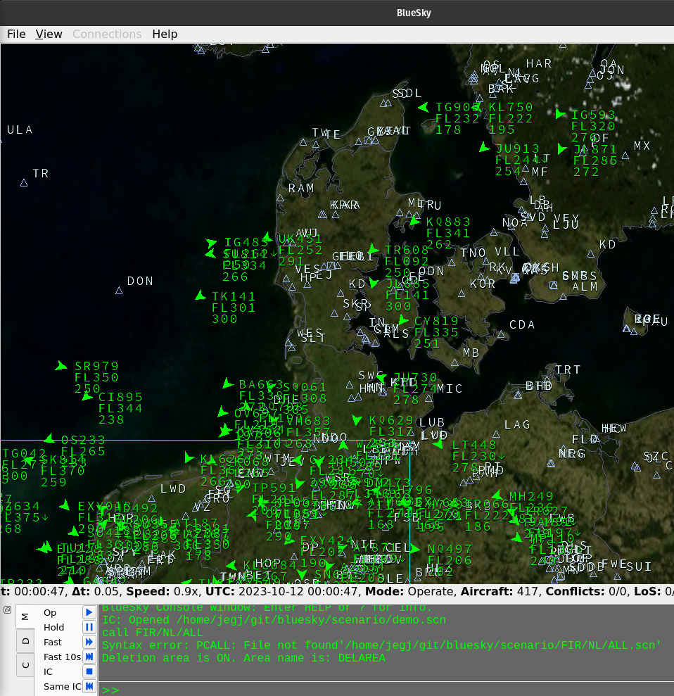
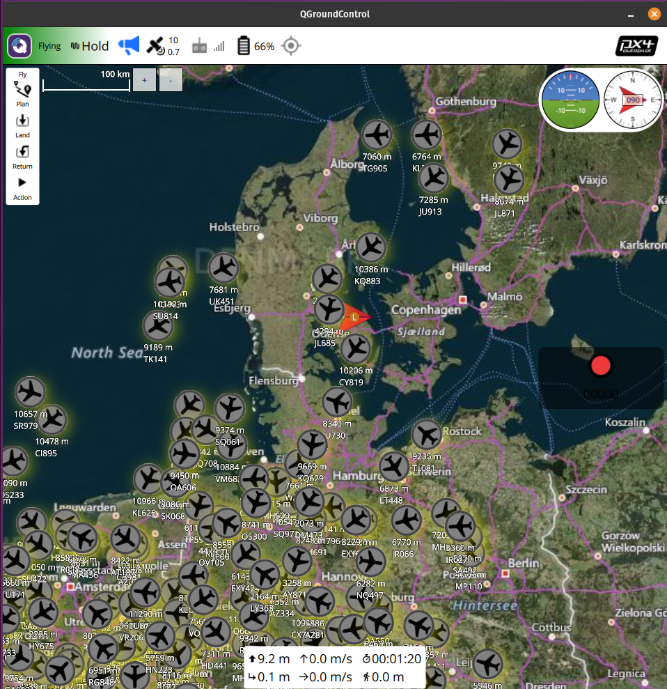

# BlueSky - The Open Air Traffic Simulator (ROS2 + PX4)
Forked from: [TUDelft-CNS-ATM/bluesky](https://github.com/TUDelft-CNS-ATM/bluesky)

## Contribution
Injecting simulated air traffic data from the BlueSky simulator into a [PX4](https://px4.io/)-based flight controller using [MAVROS](https://index.ros.org/p/mavros/). The air traffic data from the BlueSky simulator is convertet into [ADS-B messages](https://mavlink.io/en/messages/common.html#ADSB_VEHICLE) and published to the ```/mavros/adsb/send``` topic. 

BlueSky simulator          |  QGroundControl
:-------------------------:|:-------------------------:
  |  


The current version has been tested with
* Ubuntu 22.04 LTS
* [ROS2 Humble](https://docs.ros.org/en/humble/index.html) ([MAVROS](https://index.ros.org/p/mavros/) + [MAVROS Extra](https://index.ros.org/p/mavros_extras/))
* PX4-Autopilot, [v.1.13.3](https://github.com/PX4/PX4-Autopilot/releases)
* [PX4 SITL Gazebo](https://docs.px4.io/main/en/sim_gazebo_gz/)


## ROS2 Humble
Installation of ROS2 Humble for Ubuntu 22.04 is accessible at: https://docs.ros.org/en/humble/Installation/Ubuntu-Install-Debians.html

## BlueSky Wiki
Installation and user guides are accessible at:
https://github.com/TUDelft-CNS-ATM/bluesky/wiki


## PX4 Autopilot
The PX4 User Guide is accessible at: https://docs.px4.io/main/en/

